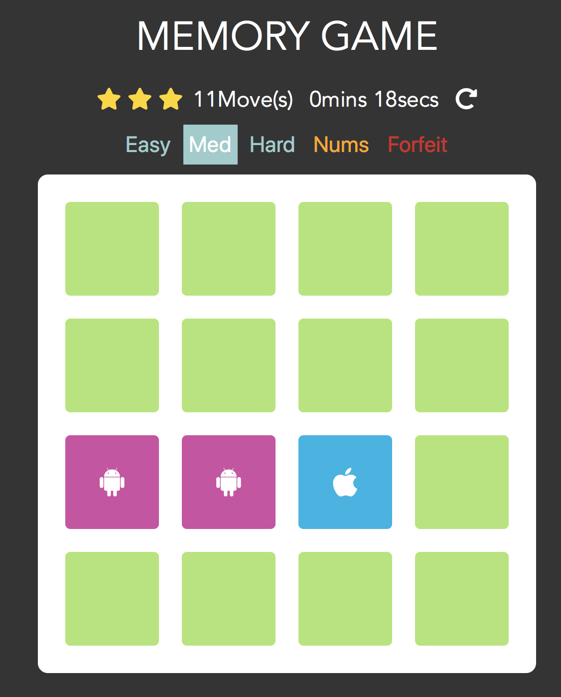

# Memory Game Project

## What Memory Game is?

A card memory game by opening two same cards to match.

## A snippet of the project



## How to play?

The link: [Memory Game](https://walkccc.github.io/webapps/MemoryGame)

There are three different difficulties in the project:

- Easy: a 2 by 2 childish board
- Medium: a 4 by 4 intermidiate level
- Hard: a 6 by 6 much more challenging board

## How to build this project?

I build this project with [JavaScript](https://www.javascript.com) language and [jQuery](https://jquery.com) library and style it with CSS.

The main function `init()`:

```javascript
function init() {
  setButtons();
  startGame();
}
```

Here I declared a `openedCard = []` to hold the opened cards (maximum = 2).

- `appendCards(n)`: appends the cards to the deck board.

- In `setButton()`, there are many tasks we have to assign:

    - set the mode buttons (Easy, Med and Hard)
    - set the restart button
    - set the NUMS button
    - set the FORFEIT button

- `shuffle()`: shuffle the given cards array.

- `matched()` and `unmatched()`: change the classes of the cards object.

- `disable()` and `enable()`: set the click behavior when cards are either matched or unmatched.

- `moveCounter()`: records the moves player made.

- `startTimer()`: starts the timer when player opens the first card (from 00:00 to 59:59).

- `addCardsListener()`: adds the necessary listeners to all cards in the board.

- `startGame()`: starts the [Memory Game](https://walkccc.github.io/webapps/MemoryGame)!

The algorithm behinds this project is easy to learn. You can download the source code and change the mechanism of generating random colors or try to add some new squares or add some buttons.

## Others

Thank you and look forward to having your opinion on this project. Feel free to give your comments. It would be nice if you could provide a bit more information on the user's behavior. You can also fork this project for any use.
